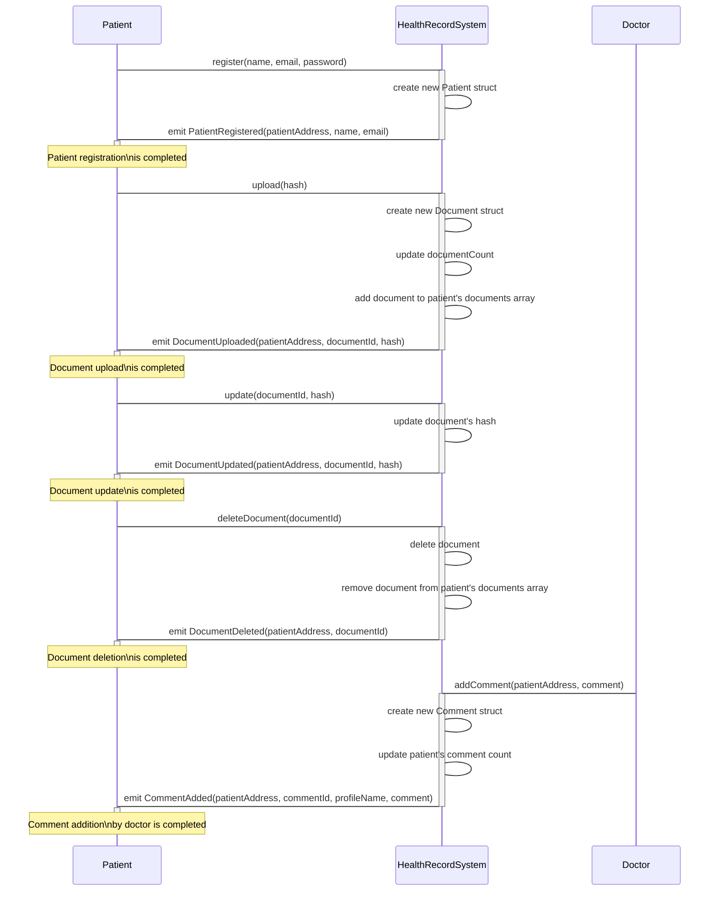

# README.md

# CareLedger

  

## Project Description: Health Record Management System

Introduction:

CareLedger is a groundbreaking Health Record Management System built on the Celo blockchain. This comprehensive solution addresses the critical challenge of efficient management, tracking, and access to health records for patients or users. The primary objective of CareLedger is to provide a user-friendly platform that empowers individuals to take control of their health information while facilitating secure collaboration with medical personnel or organizations for seamless record updates.

By deploying CareLedger on the Celo blockchain, we leverage the unique features and capabilities of this decentralized network to enhance the security, privacy, and interoperability of health records. Celo's blockchain infrastructure ensures immutability, transparency, and resilience, making it an ideal foundation for a trusted and decentralized health record management system.

With CareLedger, patients or users gain a holistic view and control over their medical information, including medical history, diagnoses, medications, allergies, test results, and other relevant data. The platform offers a user-friendly interface that is intuitive and easy to navigate, ensuring individuals of varying technical proficiency can effectively manage their health records.

One of the key advantages of deploying CareLedger on the Celo blockchain is the implementation of secure access control. Users have complete authority over who can access and modify their health records. Through smart contracts and cryptographic mechanisms, CareLedger enables patients or users to grant medical personnel or authorized organizations specific permissions to add, update, or view their records securely.

CareLedger also promotes seamless collaboration between patients or users and healthcare providers. By leveraging the Celo blockchain's real-time capabilities, medical professionals can access and update patient records instantaneously. This ensures accurate and up-to-date information is available to all relevant parties, reducing the duplication of efforts and enhancing the quality of care provided.

Furthermore, the deployment of CareLedger on the Celo blockchain facilitates data interoperability and standardization. By adhering to industry-standard data formats and protocols, CareLedger enables the exchange of health information between different healthcare providers and systems. This eliminates data silos and ensures a comprehensive and centralized view of a patient's medical information, promoting continuity of care.

Data privacy and compliance are paramount in healthcare. CareLedger on the Celo blockchain prioritizes these aspects by implementing stringent security measures such as encryption, access controls, and audit trails. It ensures that sensitive health information remains confidential and complies with relevant regulations, such as the Health Insurance Portability and Accountability Act (HIPAA) in the United States or other applicable data protection laws.


## Deployed App


Public URL: 


Contract is deployed on Celo Alfajores Testnet Network 

### Smart Contract Layer

The dApp is based on [@openzeppelin/contracts].

  
#### Smart Contracts Addresses

The application utilises the following  smart contracts, which is deployed to the **Alfajores Network** testnet, at the following addresse:

- CareLedger: (0x1851f3835311056cFc63c666A54CeC8deB95EeEc)

  
---
The following is a sequence diagram outlining the contract interactions:


---
    
### Frontend Layer


## Project Structure
#### Smart Contracts (including deployment, test scripts and NFT assets):
```
├── contracts
│ ├── HealthCareRecord.sol
├── scripts
│ ├── deploy.js
├── tests
│ └── test.ts
├── assests
│ ├──  
```
#### Frontend:
```
├── frontend
│ ├── node_modules
│ ├── package-lock.json
│ ├── package.json
│ ├── postcss.config.js
│ ├── public
│ ├── src
│ ├── tailwind.config.js
│ └── tsconfig.json
├── hardhat.config.ts
|── node_modules
├── package-lock.json
├── package.json
```
## Local Setup
Project was built and tested against:
* Node v19.7.0
* Npm v9.5.0

* **Ensure dotenv is setup with team 4 keys/signers** 

#### Smart Contracts
1. From the repo root run ``npm install``
2. Once install is complete:
	 * To **compile** the contract(s) run: 
	 ``npx hardhat compile``
	 * To **test** the contract(s) run: 
	 ``npx hardhat --network hardhat test``
	 * To **run** contracts run: 
	 ``npx hardhat --network hardhat run scripts/deployHashHive.js``

	
#### **Frontend:**
 - Cd to the **frontend** directory.
 - Run ``npm install``
 - Once install is complete:
	 * To start, run: 
	 ``npm run start``
- App will be accessible via http://localhost:3000/

## Team:

Built for the [Women Build Celo Hackathon](https://www.web3ladies.com/) by: Team Realiable


